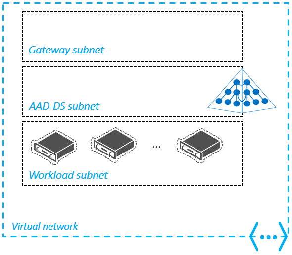

<properties
	pageTitle="Azure AD 도메인 서비스: 네트워킹 지침 | Microsoft Azure"
	description="Azure Active Directory Domain Services의 네트워킹 고려 사항"
	services="active-directory-ds"
	documentationCenter=""
	authors="mahesh-unnikrishnan"
	manager="stevenpo"
	editor="curtand"/>

<tags
	ms.service="active-directory-ds"
	ms.workload="identity"
	ms.tgt_pltfrm="na"
	ms.devlang="na"
	ms.topic="article"
	ms.date="09/20/2016"
	ms.author="maheshu"/>

# Azure AD 도메인 서비스의 네트워킹 고려 사항

## Azure 가상 네트워크를 선택하는 방법
다음 지침은 Azure AD 도메인 서비스와 함께 사용할 가상 네트워크를 선택하는 데 도움을 줍니다.

### Azure 가상 네트워크 유형

- 클래식 Azure 가상 네트워크에서 Azure AD 도메인 서비스를 활성화할 수 있습니다.

- Azure AD 도메인 서비스는 **Azure Resource Manager를 사용하여 만든 가상 네트워크에서 활성화될 수 없습니다**.

- 리소스 관리자 기반 가상 네트워크를 Azure AD 도메인 서비스가 활성화된 클래식 가상 네트워크에 연결할 수 있습니다. 그리고 나면 리소스 관리자 기반 가상 네트워크에서 Azure AD 도메인 서비스를 사용할 수 있습니다.

- **지역 가상 네트워크**: 기존 가상 네트워크를 사용할 계획인 경우 해당 네트워크가 지역 가상 네트워크인지 확인합니다.

    - 레거시 선호도 그룹 메커니즘을 사용하는 가상 네트워크는 Azure AD 도메인 서비스와 함께 사용할 수 없습니다.

	- Azure AD 도메인 서비스를 사용하려면 [레거시 가상 네트워크를 지역 가상 네트워크로 마이그레이션합니다](../virtual-network/virtual-networks-migrate-to-regional-vnet.md).

### 가상 네트워크에 대한 Azure 지역

- Azure AD 도메인 서비스 관리되는 도메인은 서비스를 활성화하도록 선택한 가상 네트워크와 동일한 Azure 지역에 배포됩니다.

- Azure AD 도메인 서비스에서 지원하는 Azure 지역에서 가상 네트워크를 선택합니다.

- Azure AD 도메인 서비스를 사용할 수 있는 Azure 지역을 알아보려면 [지역별 Azure 서비스](https://azure.microsoft.com/regions/#services/) 페이지를 참조하세요.

### 가상 네트워크에 대한 요구 사항

- **Azure 워크로드에 대한 근접성**: Azure AD 도메인 서비스에 액세스해야 하는 가상 컴퓨터를 현재 호스트하거나 호스트할 가상 네트워크를 선택합니다.

- **사용자 지정/사용자 DNS 서버 필요**: 가상 네트워크에 대해 구성된 사용자 지정 DNS 서버가 없는지 확인합니다.

- **동일한 도메인 이름의 기존 도메인**: 해당 가상 네트워크에서 동일한 도메인 이름을 사용하는 기존 도메인이 없는지 확인합니다. 예를 들어, 선택한 가상 네트워크에서 'contoso.com'이라는 도메인을 이미 사용한다고 가정합니다. 나중에 해당 가상 네트워크에서 동일한 도메인 이름(즉 'contoso.com')으로 Azure AD 도메인 서비스 관리되는 도메인을 사용하도록 설정하려고 합니다. Azure AD 도메인 서비스를 사용하도록 설정하면 오류가 발생합니다. 이 오류는 해당 가상 네트워크에서 도메인 이름이 충돌하기 때문입니다. 이 경우 다른 이름을 사용하여 Azure AD 도메인 서비스 관리되는 도메인을 설정해야 합니다. 또는 기존 도메인을 프로비전 해제한 후 Azure AD 도메인 서비스를 사용하도록 설정할 수 있습니다.

> [AZURE.WARNING] 이 서비스를 사용하도록 설정한 후에는 도메인 서비스를 다른 가상 네트워크로 이동할 수 없습니다.

## 네트워크 보안 그룹 및 서브넷 디자인
[NSG(네트워크 보안 그룹)](../virtual-network/virtual-networks-nsg.md)는 ACL(액세스 제어 목록)의 가상 네트워크에 VM 인스턴스에 대한 허용 또는 거부 네트워크 트래픽 규칙의 목록을 포함합니다. NSG는 서브넷 또는 서브넷 내의 개별 VM 인스턴스 중 하나와 연결될 수 있습니다. NSG를 서브넷과 연결한 경우 ACL 규칙은 해당 서브넷에 있는 모든 VM 인스턴스에 적용됩니다. 또한 개별 VM에 대한 트래픽은 해당 VM에 직접 NSG를 연결하여 추가로 제한할 수 있습니다.

> [AZURE.NOTE] **Azure 가상 네트워크 내의 별도 전용 서브넷에 Azure AD 도메인 서비스를 배포합니다. 해당 전용 서브넷에 NSG를 적용하지 마십시오. 가상 네트워크의 게이트웨이 서브넷에서 Azure AD 도메인 서비스를 활성화하지 마십시오.**

> [AZURE.WARNING] NSG를 Azure AD 도메인 서비스가 활성화된 서브넷에 연결하는 경우 Microsoft의 도메인 서비스 및 관리 기능에 방해가 될 수 있습니다. 또한 Azure AD 테넌트와 관리되는 도메인 간의 동기화가 중단됩니다. **SLA는 NSG가 Azure AD 도메인 서비스가 활성화된 서브넷에 적용된 배포에 적용되지 않습니다.**

## 네트워크 연결
Azure AD 도메인 서비스 관리되는 도메인은 Azure에서 단일 클래식 가상 네트워크 내에서만 활성화될 수 있습니다. Azure Resource Manager를 사용하여 만든 가상 네트워크는 지원되지 않습니다.

### Azure 네트워크 연결에 대한 시나리오
다음 배포 시나리오 중 하나에서 관리되는 도메인을 사용하여 Azure 가상 네트워크를 연결합니다.

#### 둘 이상의 Azure 클래식 가상 네트워크에서 관리되는 도메인 사용
다른 Azure 클래식 가상 네트워크를 Azure AD 도메인 서비스가 활성화된 Azure 클래식 가상 네트워크에 연결할 수 있습니다. 이 연결을 통해 다른 가상 네트워크에 배포된 작업과 함께 관리되는 도메인을 사용할 수 있습니다.

#### 리소스 관리자 기반 가상 네트워크에서 관리되는 도메인 사용
리소스 관리자 기반 가상 네트워크를 Azure AD 도메인 서비스가 활성화된 Azure 클래식 가상 네트워크에 연결할 수 있습니다. 이 연결을 통해 리소스 관리자 기반 가상 네트워크에 배포된 작업과 함께 관리되는 도메인을 사용할 수 있습니다.

### 네트워크 연결 옵션

- **사이트 간 VPN 연결을 사용하여 VNet 간 연결**: 가상 네트워크를 다른 가상 네트워크에 연결(VNet 간)하는 것은 가상 네트워크를 온-프레미스 사이트 위치에 연결하는 것과 유사합니다. 두 연결 유형 모두 VPN 게이트웨이를 사용하여 IPsec/IKE를 통한 보안 터널을 제공합니다.

	

    [추가 정보 - VPN 게이트웨이를 사용하여 가상 네트워크 연결](../vpn-gateway/virtual-networks-configure-vnet-to-vnet-connection.md)

- **가상 네트워크 피어링을 사용하여 VNet 간 연결**: 가상 네트워크 피어링은 Azure 백본 네트워크를 통해 동일한 지역에 있는 두 개의 가상 네트워크를 연결하는 메커니즘입니다. 두 가상 네트워크가 피어링되면 모든 연결에 대해 하나로 표시됩니다. 여전히 별도 리소스로 관리할 수는 있지만 이러한 가상 네트워크의 가상 컴퓨터는 개인 IP 주소를 사용하여 직접 서로 통신할 수 있습니다.

    

	[추가 정보 - 가상 네트워크 피어링](../virtual-network/virtual-network-peering-overview.md)

 

## 관련 콘텐츠

- [Azure 가상 네트워크 피어링](../virtual-network/virtual-network-peering-overview.md)

- [클래식 배포 모델에 대한 VNet 간 연결 구성](../vpn-gateway/virtual-networks-configure-vnet-to-vnet-connection.md)

- [Azure 네트워크 보안 그룹](../virtual-network/virtual-networks-nsg.md)

<!---HONumber=AcomDC_0921_2016-->